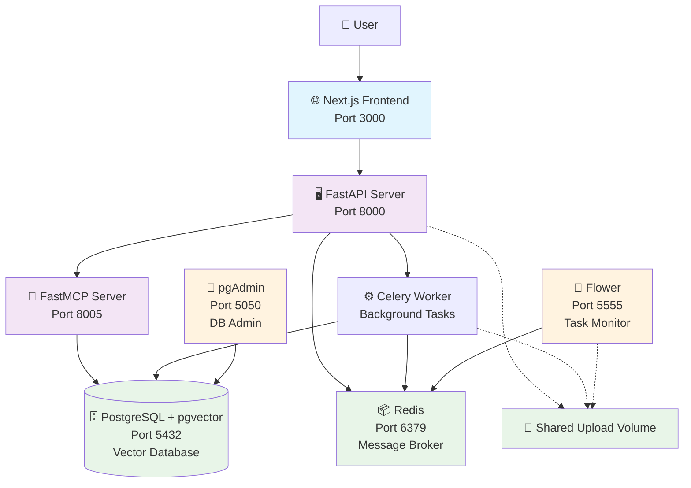

# AI-Powered Resume Processing & Chat System

A comprehensive full-stack application that combines resume processing, semantic search, and AI-powered chat capabilities. Built with modern microservices architecture using FastAPI, Next.js, and advanced AI technologies.

## 🌟 Overview

This system provides an intelligent resume processing platform where users can:
- Upload PDF resumes for automated processing and analysis
- Chat with an AI assistant about resume content using natural language
- Perform semantic search across uploaded resumes
- Leverage advanced language models for resume insights and recommendations

## 🏗️ Architecture

The system follows a microservices architecture with the following components:



## 🚀 Key Features

### Resume Processing
- **Multi-file PDF upload** with drag-and-drop interface
- **Asynchronous processing** using Celery for scalability
- **Intelligent text chunking** for optimal embedding generation
- **Vector storage** in PostgreSQL with pgvector extension
- **Semantic search** capabilities using Google Generative AI

### AI Chat Interface
- **Streaming chat responses** for real-time interaction
- **Context-aware conversations** about uploaded resumes
- **Model Context Protocol (MCP)** integration for advanced AI capabilities
- **Markdown support** for rich text rendering
- **Message history** persistence

### System Management
- **Docker containerization** for easy deployment
- **Health checks** for service monitoring
- **Flower dashboard** for Celery task monitoring
- **pgAdmin** for database administration
- **CORS support** for frontend-backend communication

## 🛠️ Technology Stack

### Backend
- **FastAPI** - Modern Python web framework
- **Celery** - Asynchronous task queue
- **Redis** - Message broker and caching
- **PostgreSQL** - Primary database
- **pgvector** - Vector similarity search
- **LangChain** - AI/ML framework
- **Google Generative AI** - Embeddings and language models

### Frontend
- **Next.js 15** - React framework with Turbopack
- **TypeScript** - Type-safe development
- **Tailwind CSS** - Utility-first styling
- **React Markdown** - Rich text rendering

### DevOps & Infrastructure
- **Docker** & **Docker Compose** - Containerization
- **Python 3.11+** - Backend runtime
- **Node.js 20** - Frontend runtime
- **UV** - Fast Python package installer

## 📦 Quick Start

### Prerequisites
- Docker and Docker Compose
- Google API key for Generative AI
- 8GB+ RAM recommended
- 10GB+ free disk space

### 1. Clone the Repository
```bash
git clone <repository-url>
cd assignment
```

### 2. Environment Configuration

#### FastAPI Server Configuration
```bash
cp fastapi-server/.env.example fastapi-server/.env
```

Edit `fastapi-server/.env`:
```env
# Database Configuration
PG_CONNECTION_STRING=postgresql://postgres:postgres@db:5432/resumedb

# Redis/Celery Configuration  
CELERY_BROKER_URL=redis://redis:6379/0
CELERY_RESULT_BACKEND=redis://redis:6379/0

# Google AI Configuration
GOOGLE_API_KEY=your_google_api_key_here
EMBEDDING_MODEL=models/embedding-001

# System Configuration
UPLOAD_DIR=/tmp/resume_uploads
MODEL_NAME=gemini-2.0-flash-exp
MODEL_PROVIDER=google_genai
```

#### FastMCP Server Configuration
```bash
cp fastmcp-server/.env.example fastmcp-server/.env
```

Edit `fastmcp-server/.env`:
```env
PG_CONNECTION_STRING=postgresql://postgres:postgres@db:5432/resumedb
GOOGLE_API_KEY=your_google_api_key_here
EMBEDDING_MODEL=models/embedding-001
```

### 3. Launch the System
```bash
# Start all services
docker-compose up -d

# View startup logs
docker-compose logs -f

# Check service status
docker-compose ps
```

### 4. Access the Application

Once all services are running, access:

| Service | URL | Purpose |
|---------|-----|---------|
| **Main Application** | http://localhost:3000 | Frontend chat interface |
| **API Documentation** | http://localhost:8000/docs | Swagger UI for API |
| **Database Admin** | http://localhost:5050 | pgAdmin interface |
| **Task Monitor** | http://localhost:5555 | Flower Celery dashboard |
| **FastMCP Server** | http://localhost:8005 | MCP protocol endpoint |

#### Default Credentials
- **pgAdmin**: admin@admin.com / admin
- **PostgreSQL**: postgres / postgres


## 🔧 Configuration & Customization

### Environment Variables

#### Core System
| Variable | Description | Default |
|----------|-------------|---------|
| `PG_CONNECTION_STRING` | PostgreSQL connection URL | `postgresql://postgres:postgres@db:5432/resumedb` |
| `CELERY_BROKER_URL` | Redis broker for Celery | `redis://redis:6379/0` |
| `CELERY_RESULT_BACKEND` | Redis backend for Celery | `redis://redis:6379/0` |
| `UPLOAD_DIR` | Directory for file uploads | `/tmp/resume_uploads` |

#### AI Configuration
| Variable | Description | Default |
|----------|-------------|---------|
| `GOOGLE_API_KEY` | Google AI API key | **Required** |
| `EMBEDDING_MODEL` | Embedding model name | `models/embedding-001` |
| `MODEL_NAME` | Chat model name | `gemini-2.0-flash-exp` |
| `MODEL_PROVIDER` | Model provider | `google_genai` |

#### Frontend
| Variable | Description | Default |
|----------|-------------|---------|
| `NEXT_PUBLIC_API_URL` | Backend API URL | `http://localhost:8000` |


#### Database Performance
```bash
# Access PostgreSQL for optimization
docker-compose exec db psql -U postgres -d resumedb

# Create additional indexes for performance
CREATE INDEX CONCURRENTLY ON documents USING ivfflat (embedding vector_cosine_ops);
```

## 📁 Project Structure

### 🏠 Root Directory
```
assignment/
├── docker-compose.yaml
├── README.md
├── fastapi-server/
├── fastmcp-server/
└── next-frontend/
```

### 🖥️ FastAPI Server Structure
```
fastapi-server/
├── app/
│   ├── __init__.py
│   ├── main.py
│   ├── core.py
│   ├── worker.py
│   ├── config/
│   │   ├── __init__.py
│   │   └── settings.py
│   ├── routes/
│   │   ├── __init__.py
│   │   ├── upload.py
│   │   └── chat.py
│   ├── schemas/
│   │   ├── __init__.py
│   │   ├── request.py
│   │   └── chat.py
│   ├── ingestion/
│   │   ├── __init__.py
│   │   └── service.py
│   ├── agents/
│   │   ├── __init__.py
│   │   └── mcp_agent.py
│   └── utils/
│       ├── __init__.py
│       └── helpers.py
├── __pycache__/
├── Dockerfile
├── requirements.txt
├── pyproject.toml
├── uv.lock
└── README.md
```
```
fastapi-server/
├── 📁 app/                         # Main application package
│   ├── 🐍 __init__.py             # Package initialization
│   ├── 🐍 main.py                 # FastAPI application entry point
│   ├── 🐍 core.py                 # Core FastAPI app configuration
│   ├── ⚙️ worker.py               # Celery task definitions & worker
│   │
│   ├── � config/                  # Configuration management
│   │   ├── 🐍 __init__.py         # Package initialization
│   │   └── ⚙️ settings.py         # Environment variables & settings
│   │
│   ├── 📁 routes/                  # API endpoint definitions
│   │   ├── 🐍 __init__.py         # Package initialization
│   │   ├── 📤 upload.py           # File upload endpoints & logic
│   │   └── 💬 chat.py             # Chat API endpoints & streaming
│   │
│   ├── 📁 schemas/                 # Pydantic models & validation
│   │   ├── 🐍 __init__.py         # Package initialization
│   │   ├── 📝 request.py          # API request/response models
│   │   └── 💬 chat.py             # Chat-specific data schemas
│   │
│   ├── 📁 ingestion/               # Document processing pipeline
│   │   ├── � __init__.py         # Package initialization
│   │   └── 🔄 service.py          # PDF processing & vectorization
│   │
│   ├── 📁 agents/                  # AI agent management
│   │   ├── 🐍 __init__.py         # Package initialization
│   │   └── 🤖 mcp_agent.py        # MCP agent configuration & logic
│   │
│   └── 📁 utils/                   # Utility functions & helpers
│       ├── 🐍 __init__.py         # Package initialization
│       └── 🛠️ helpers.py          # File handling & common utilities
│
├── 📁 __pycache__/                 # Python bytecode cache
├── 🐳 Dockerfile                   # Container configuration
├── 📦 requirements.txt             # Python dependencies (pip)
├── ⚙️ pyproject.toml              # Project metadata & dependencies (UV)
├── 🔒 uv.lock                     # UV dependency lock file
└── 📄 README.md                   # Service-specific documentation
```

### 🔌 FastMCP Server Structure
```
fastmcp-server/
├── server.py
├── config.py
├── __pycache__/
├── Dockerfile
├── requirements.txt
├── pyproject.toml
├── uv.lock
└── README.md
```

### 🌐 Next.js Frontend Structure
```
next-frontend/
├── src/
│   ├── app/
│   │   ├── globals.css
│   │   ├── layout.tsx
│   │   ├── page.tsx
│   │   └── favicon.ico
│   ├── components/
│   │   └── ChatInterface.tsx
│   └── utils/
│       └── api.ts
├── public/
│   ├── file.svg
│   ├── globe.svg
│   ├── next.svg
│   ├── vercel.svg
│   └── window.svg
├── Dockerfile
├── package.json
├── next.config.ts
├── tsconfig.json
├── next-env.d.ts
├── eslint.config.mjs
├── postcss.config.mjs
└── README.md
```

## 🚀 Deployment Options

### Production Deployment

#### Kubernetes
```yaml
# Example deployment configuration
apiVersion: apps/v1
kind: Deployment
metadata:
  name: fastapi-server
spec:
  replicas: 3
  selector:
    matchLabels:
      app: fastapi-server
  template:
    metadata:
      labels:
        app: fastapi-server
    spec:
      containers:
      - name: fastapi
        image: resume-app/fastapi-server:latest
        ports:
        - containerPort: 8000
```

## 📚 Additional Resources

### Documentation
- [FastAPI Documentation](https://fastapi.tiangolo.com/)
- [Next.js Documentation](https://nextjs.org/docs)
- [LangChain Documentation](https://docs.langchain.com/)
- [pgvector Documentation](https://github.com/pgvector/pgvector)
- [Celery Documentation](https://docs.celeryproject.org/)

### API References
- [Google Generative AI API](https://ai.google.dev/docs)
- [PostgreSQL Documentation](https://www.postgresql.org/docs/)
- [Redis Documentation](https://redis.io/documentation)

### Community
- [FastAPI Community](https://github.com/tiangolo/fastapi/discussions)
- [LangChain Community](https://github.com/langchain-ai/langchain/discussions)
- [Next.js Community](https://github.com/vercel/next.js/discussions)
